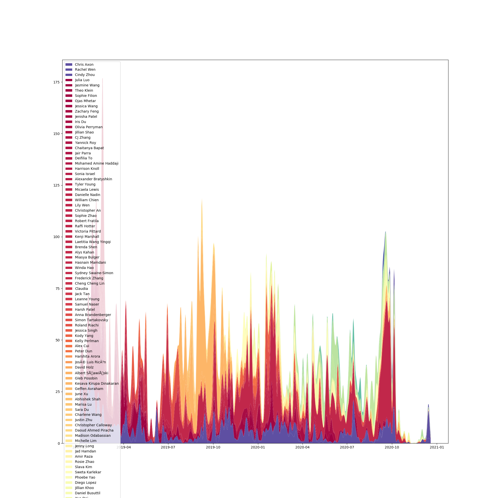

# README

## Graph visualization

To make graph visualization,

1. Download Messenger data from Facebook and move the downloaded `messages` folder into this folder
2. run `python3 parse_messages_time_domain.py` to generate timestamp JSON
3. run `python3 timestamp_analysis.py` to get pictures :)

## Other files

_parse_messages.py_ takes data form json and parses it into of dics for each person
_convo_anal_1_ for the moment it generate the does tfidf dictionary

## Ideas

- featurise each person / human readable insights for each person
- featurise yourself per conversation
- find online dictionary of expressions classified by something like affectio

### Quotes

> When people are being deceptive in laboratory experiments, their use of first person singular drops significantly. Dr. James explains, "indeed, the use of 'I' is one of the best predictors of hoesty." Hoe much more can we learn by analyzing how a person speaks about themselves and the choice of words they use?
